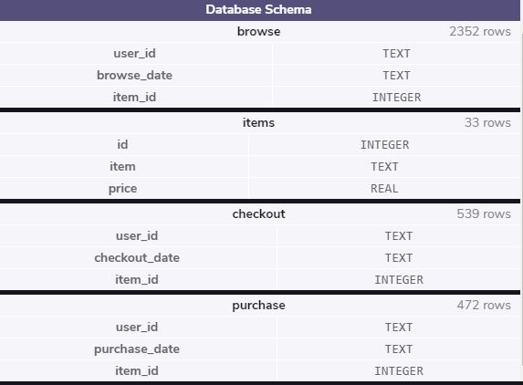
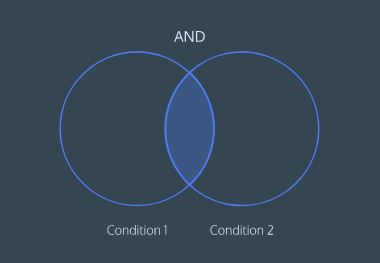
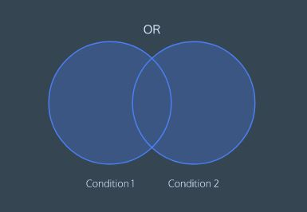

# SQL and Databases for Web Development
Learn the SQL fundamentals needed to be a successful full-stack web developer.

- Writing basic queries
- Calculating aggregates
- Combining data from multiple tables
- Determining web traffic attribution
- Creating usage funnels
- Analyzing user churn

**Preview of the test database used in the exercises**

## LESSON 1 Queries

Learn the most commonly used SQL commands to query a table in a database.

Exercises

- [x] 1. Introduction

- [x] 2. Select

- [x] 3. As

- [x] 4. Distinct

- [x] 5. Where

- [x] 6. Like I

- [x] 7. Like II

- [x] 8. Is Null

- [x] 9. Between

- [x] 10. And

- [x] 11. Or

- [x] 12. Order By

- [x] 13. Limit

- [x] 13. Case

## LESSON 2 Manipulation

Get up and running with SQL by learning commands to manipulate data stored in relational databases.

Exercises

- [ ] 1. Introduction to SQL

- [ ] 2. Relational Databases

- [ ] 3. Statements

- [ ] 4. Create

- [ ] 5. Insert

- [ ] 6. Select

- [ ] 7. Alter

- [ ] 8. Update

- [ ] 9. Delete

- [ ] 10. Constraints