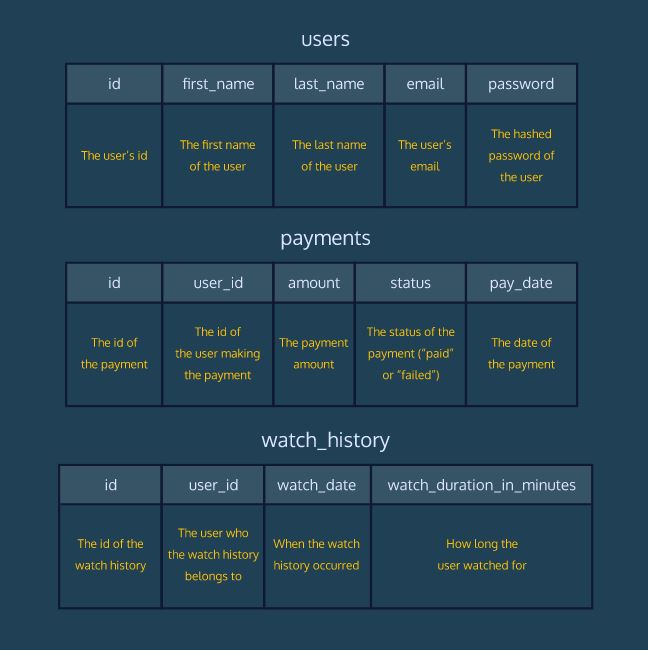
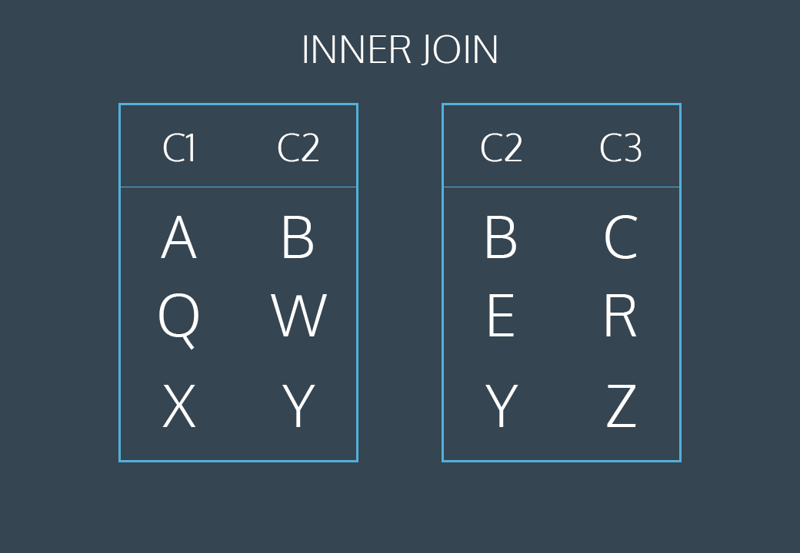
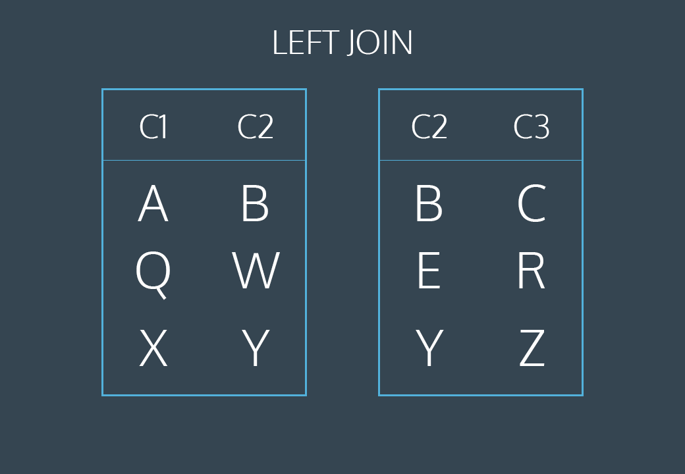

# SQL and Databases for Web Development
Learn the SQL fundamentals needed to be a successful full-stack web developer.

- Writing basic queries
- Calculating aggregates
- Combining data from multiple tables
- Determining web traffic attribution
- Creating usage funnels
- Analyzing user churn

**Preview of the test database used in the exercises**

## LESSON 1 Queries

Learn the most commonly used SQL commands to query a table in a database.

Exercises

- [x] 1. Introduction

- [x] 2. Select

- [x] 3. As

- [x] 4. Distinct

- [x] 5. Where

- [x] 6. Like I

- [x] 7. Like II

- [x] 8. Is Null

- [x] 9. Between

- [x] 10. And

- [x] 11. Or

- [x] 12. Order By

- [x] 13. Limit

- [x] 13. Case

## LESSON 2 Manipulation

Get up and running with SQL by learning commands to manipulate data stored in relational databases.

Exercises

- [x] 1. Introduction to SQL

- [x] 2. Relational Databases

- [x] 3. Statements

- [x] 4. Create

- [x] 5. Insert

- [x] 6. Select

- [x] 7. Alter

- [x] 8. Update

- [x] 9. Delete

- [x] 10. Constraints

## LESSON 3 Aggregate Functions

Learn how to use SQL to perform calculations during a query.

Exercises

- [x] 1. Introduction

- [x] 2. Count

- [x] 3. Sum

- [x] 4. Max / Min

- [x] 5. Average

- [x] 6. Round

- [x] 7. Group By I

- [x] 8. Group By II

- [x] 9. Having

## LESSON 4 Code Challenge: Aggregate Functions

Help the Codeflix streaming video site analyze some of their customer data using SQL aggregates.

## LESSON 5 Multiple Tables

Learn how to query multiple tables using joins.

Exercises

- [x] 1. Introduction

- [x] 2. Combining Tables Manually

- [x] 3. Combining Tables with SQL

- [x] 4. Inner Joins

- [x] 5. Left Joins

- [x] 6. Primary Key vs Foreign Key

- [x] 7. Cross Join

- [x] 8. Union

- [x] 9. With