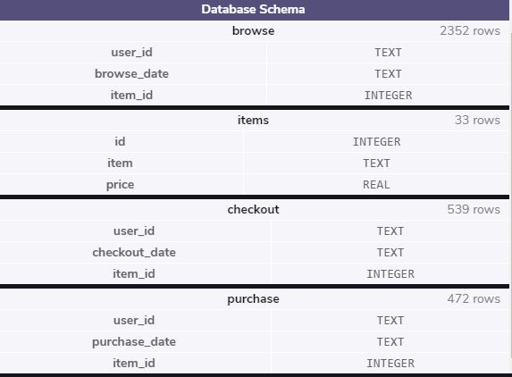
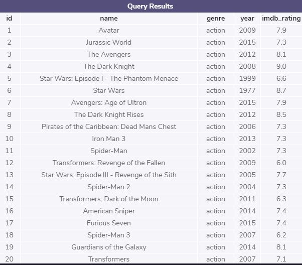
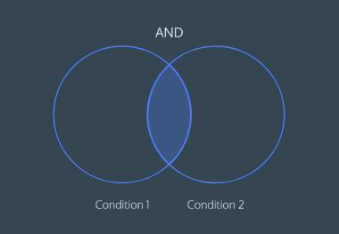
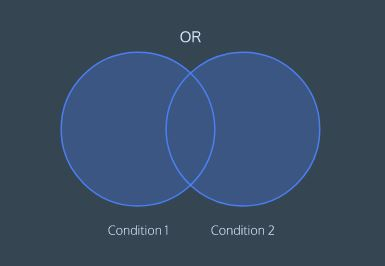
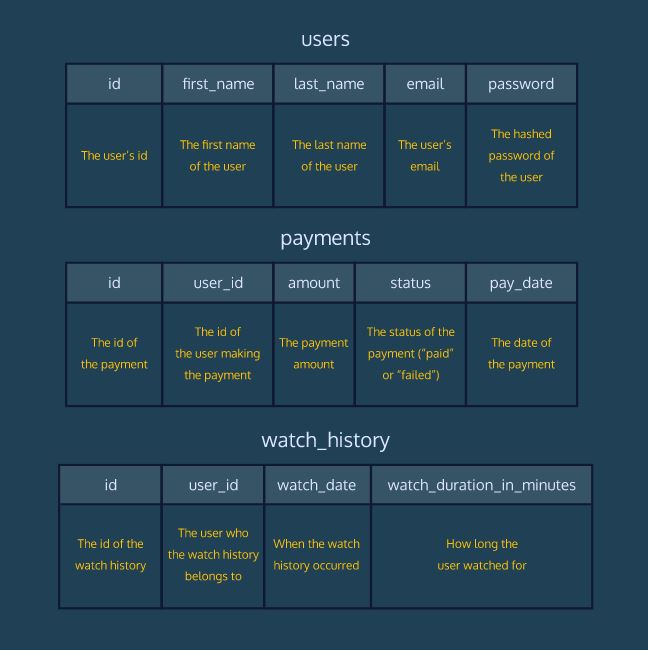

# SQL and Databases for Web Development
Learn the SQL fundamentals needed to be a successful full-stack web developer.

- Writing basic queries
- Calculating aggregates
- Combining data from multiple tables
- Determining web traffic attribution
- Creating usage funnels
- Analyzing user churn

**Preview of the test database used in the exercises**

## LESSON 1 Queries

Learn the most commonly used SQL commands to query a table in a database.

Exercises

- [x] 1. [Introduction](./1-Queries/1-query.sql)

- [x] 2. [Select](./1-Queries/2-select.sql)

- [x] 3. [As](./1-Queries/3-as.sql)

- [x] 4. [Distinct](./1-Queries/4-distinct.sql)

- [x] 5. [Where](./1-Queries/5-where.sql)

- [x] 6. [Like I](./1-Queries/6-like.sql)

- [x] 6.1 [Like II](./1-Queries/6-like.sql)

- [x] 7. [Is Null](./1-Queries/7-is-nul.sql)

- [x] 8. [Between](./1-Queries/8-between.sql)

- [x] 9. [And](./1-Queries/9-and.sql)

- [x] 10. [Or](./1-Queries/10-or.sql)

- [x] 11. [Order By](./1-Queries/11-order-by.sql)

- [x] 12. [Limit](./1-Queries/12-limit.sql)

- [x] 13. [Case](./1-Queries/13-case.sql)

## LESSON 2 Manipulation

Get up and running with SQL by learning commands to manipulate data stored in relational databases.

Exercises

- [x] 1. Introduction to SQL

- [x] 2. Relational Databases

- [x] 3. [Statements](./3-Manipulation/1-statements.sql)

- [x] 4. [Create](./3-Manipulation/2-create.sql)

- [x] 5. [Insert](./3-Manipulation/3-Insert.sql)

- [x] 6. [Select](./3-Manipulation/4-Select.sql)

- [x] 7. [Alter](./3-Manipulation/5-alter.sql)

- [x] 8. [Update](./3-Manipulation/6-update.sql)

- [x] 9. [Delete](./3-Manipulation/7-delete.sql)

- [x] 10. [Constraints](./3-Manipulation/8-constraints.sql)

## LESSON 3 Aggregate Functions

Learn how to use SQL to perform calculations during a query.

Exercises

- [x] 1. Introduction

- [x] 2. [Count](./4-Aggregate%20Functions/1-count.sql)

- [x] 3. [Sum](./4-Aggregate%Functions/2-sum.sql)

- [x] 4. [Max-Min](./4-Aggregate%Functions/3-max-min.sql)

- [x] 5. [Average](./4-Aggregate%Functions/4-average.sql)

- [x] 6. [Round](./4-Aggregate%Functions/5-round.sql)

- [x] 7. [Group By I](./4-Aggregate%Functions/6-group-by.sql)

- [x] 8. Group By II

- [x] 9. [Having](./4-Aggregate%Functions/7-having.sql)

## LESSON 4 Code Challenge: Aggregate Functions

Help the Codeflix streaming video site analyze some of their customer data using SQL aggregates.

## LESSON 5 Multiple Tables

Learn how to query multiple tables using joins.

Exercises

- [x] 1. [Introduction](./6-Multiple%Tables/1-Introduction.sql)

- [x] 2. [Combining Tables Manually](./6-Multiple%Tables/2-CombiningTables.sql)

- [x] 3. Combining Tables with SQL

- [x] 4. [Inner Joins](./6-Multiple%Tables/3-InnerJoins.sql)

- [x] 5. [Left Joins](./6-Multiple%Tables/4-LeftJoins.sql)

- [x] 6. [Primary Key vs Foreign Key](./6-Multiple%Tables/5-Primary-ForeignKey.sql)

- [x] 7. [Cross Join](./6-Multiple%Tables/6-CrossJoin.sql)

- [x] 8. [Union](./6-Multiple%Tables/7-Union.sql)

- [x] 9. [With](./6-Multiple%Tables/8-With.sql)

## LESSON 6 Learn Node SQLite

Learn how to use the sqlite3 node package to perform create, read, update, & delete operations on an SQLite database within JavaScript.

Exercises 

- [x] 1. [Introduction](./8-Node%SQLite/1-Introduction.js)

- [x] 2. [Opening A Database](./8-Node%SQLite/2-OpeningDatabase.js)

- [x] 3. [Retrieving All Rows](./8-Node%SQLite/3-RetrievingAllRows.js)

- [x] 4. [Retrieving A Single Row](./8-Node%SQLite/4-RetrievingSingleRow.js)

- [x] 5. [Using Placeholders](./8-Node%SQLite/5-UsingPlaceholders.js)

- [x] 6. [Using db.run()](./8-Node%SQLite/6-UsingDBrun.js)

- [x] 7. [Handling Errors Gracefully](./8-Node%SQLite/7-HandlingErrorsGracefully.js)

- [x] 8. [Using db.each()](./8-Node%SQLite/8-UsingDBeach.js)

- [x] 9. [Creating A New Table](./8-Node%SQLite/9-CreatingNewTable.js)

- [x] 10. [Serial Queries](./8-Node%SQLite/10-SerialQueries.js)

- [x] 11. Wrap Up

---

[SQL Tutorial](https://www.w3schools.com/sql/)

[SQLite Documentation](https://www.sqlite.org/docs.html)